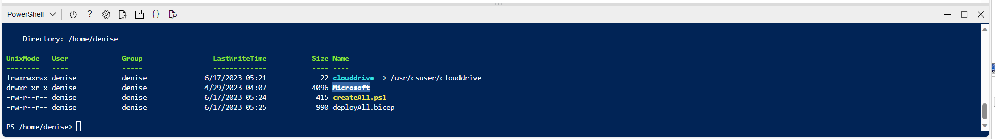

# Azure Data and AI examples

This repo contains code examples for Data and AI in Azure in Python as follows:
## Adx-datalakehouse folder
- Contains the code to setup a Data Lakehouse using Azure Data Explorer (Kusto) - 

As businesses continue to generate massive amounts of data, the need for efficient data management solutions becomes increasingly important. This is where a data lake house comes in - an hybrid solution that combines the best features of a datalake and a data warehouse.

Learn how to build a data lakehouse using Azure Data Explorer (ADX) where the data flows from Azure SQL DB using Change Data Capture (CDC) through Azure Data Factory and events flowing from events hub.
						
[Part 1 - Building a Data Lakehouse using Azure Data Explorer](https://techcommunity.microsoft.com/t5/startups-at-microsoft/building-a-data-lakehouse-using-azure-data-explorer/ba-p/3805913)

[Part 2 - Building a Data Lakehouse using Azure Data explorer - The Deployment](https://techcommunity.microsoft.com/t5/startups-at-microsoft/part-2-building-a-data-lakehouse-using-azure-data-explorer-the/ba-p/3842088)

## Cognitive services folder
#### form_recognizer_invoices
This example shows how to extract json data from invoices using the Form Recognizer SDK.
#### image_tagging_ocr
This example shows how to extract tags from Images using Azure Computer Vision services SDK.

## OpenAI folder
Contains many examples on how to connect to Azure OpenAI 
You can find full guides here:
[Build a chatbot to query your documentation using Langchain and Azure OpenAI](https://techcommunity.microsoft.com/t5/startups-at-microsoft/build-a-chatbot-to-query-your-documentation-using-langchain-and/ba-p/3833134)

[Use OpenAI GPT with your Enterprise Data](https://techcommunity.microsoft.com/t5/startups-at-microsoft/use-openai-gpt-with-your-enterprise-data/ba-p/3817141)


## Requirements
- VsCode
- Python 3.7
- A virtual environment tool (venv)
- An Azure account 
- An active Azure OpenAI account with 2 deployed models see below

## Preparation

## OpenAI subscription and deployments
* Create an Azure OpenAI account
* Create 'gpt-35-turbo' and 'text-embedding-ada-002' deployments

### VsCode
* Install [Visual Studio Code](https://code.visualstudio.com/)

### Python
* Install [Python 3.7](https://www.python.org/downloads/release/python-31011/)

### Python3 Virtualenv Setup
*  Installation
        To install virtualenv via pip run:
            $ pip3 install virtualenv
* Creation of virtualenv:
    - Windows
    $ python -m virtualenv venv (in the openAI workshop directory)
    - Mac
    $ virtualenv -p python3 <desired-path>

    Activate the virtualenv:
    $ source <desired-path>/bin/activate

    Deactivate the virtualenv:
    $ deactivate

#### Python3 Virtualenv Setup
*  Installation
        To install virtualenv via pip run:
            $ pip3 install virtualenv
* Creation of virtualenv:
    - Windows
    $ python -m virtualenv venv (in the openAI workshop directory)
    - Mac
    $ virtualenv -p python3 <desired-path>

### Install all libraries in your virtual environment
* Activate the environment
    Windows:
        .\venv\Scripts\activate.ps1
    Mac:
    $ source ./venv/bin/activate

* Make sure you have the requirements installed in your Python environment using `pip install -r requirements.txt`.


### Create a sample Azure SQL DB with Adventureworks sample data
* Insert your subscription ID in the file [createAll.ps1](./scripts/createAll.ps1) and save it. 
    ```
    $SubscriptionId = "<your subscription here>"
    ```
* Insert a name for your sql server in the file [deployAll.bicep](./scripts/deployAll.bicep) and save it
    ```
    param serverName string = '<sql server name>'
    ```
* This powershell script will create:
    * A resourcegroup called openai-workshop
    * An Azure SQL server called <your sql server name> with an AdventureWorks DB

* Go to the azure portal and login with a user that has administrator permissions
* Open the cloud shell in the azure portal as follows:


* Upload the files in the scripts folder: "createAll.ps1" and "deployAll.bicep" ONE BY ONE by using the upload file button in the cloud shell


* Run ./createAll.ps1

NOTE: This takes time so be patient
You should get an Azure SQL server with a DB called aworks


# IMPORTANT!
### Setup environment variables
* Rename the '.env.template' file to '.env' and modify all the endpoints and api keys for all openai deployments as follows:
```
OPENAI_DEPLOYMENT_ENDPOINT ="<your openai endpoint>" 
OPENAI_API_KEY = "<your openai api key>"
OPENAI_DEPLOYMENT_NAME = "<your gpt35 deployment name>"
OPENAI_DEPLOYMENT_VERSION = "<gpt35 api version>"
OPENAI_MODEL_NAME="<gpt35 model name>"

OPENAI_ADA_EMBEDDING_DEPLOYMENT_NAME = "<your text embedding ada deployment name>"
OPENAI_ADA_EMBEDDING_MODEL_NAME = "<your text embedding ada model name>"

SQL_SERVER="<your sql server>.database.windows.net"
SQL_USER="SqlAdmin"
SQL_PWD="ChangeYourAdminPassword1"
SQL_DBNAME="aworks"
```